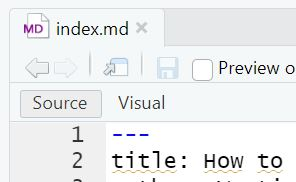

# How to Contribute to Our website with Blog Posts Using R and RStudio

**Hello, esteemed statisticians and fellows of WeData!**

I appreciate your dedication and knowledge, and now I offer an opportunity for you to share your wisdom with the world! If you're comfortable using R and RStudio, I believe that the process will be smooth, faster, and easier. This guide will walk you through the process of contributing to our group via blog posts. **Let's start this journey together!**

### Prerequisites:

Before I delve into the details, there are a couple of things you need:

1. **GitHub Account**: If you don't have one yet, simply visit [GitHub](https://github.com/) and register an account. Once you've done that, share your GitHub username with us, and I will add you to our group account. **Not familiar with GitHub?** No worries! Here's a [Amazing video tutorial](https://www.youtube.com/watch?v=8Dd7KRpKeaE) that will guide you on how GitHub works including understanding repositories, commits, pushes, pulls, and fetch. It will also show you how to use GitHub Desktop **if you allergic to terminals**,

### Step-by-step Guide:

Now, let's move onto the core part:

#### Step 1: Clone the Repository 

On your local machine, clone the repository `we-data-ch/blog` in the place you want. To do so, open your terminal and type:

```bash
git clone https://github.com/usour/glave.git
```

**Again, if you are allergic to terminals** [you can clone  the repository using  GitHub Desktop](https://docs.github.com/en/desktop/contributing-and-collaborating-using-github-desktop/adding-and-cloning-repositories/cloning-and-forking-repositories-from-github-desktop)

This will create a copy of our repository on your machine.

#### Step 2: Open the Repository in RStudio 

I recommend you to open the cloned repository in RStudio as a project. In RStudio, go to `File > New Project > Existing Directory`, and then navigate to the `blog` folder. This will set up your environment and make the workflow smoother.

#### Step 3: Install the blogdown Package 

In case you have not installed it yet, use the following command to install the `blogdown` package:

```r
install.packages("blogdown")
```

Once it is installed, you need to restart R to make sure everything is properly loaded.

#### Step 4: Start a New Article

Now you're ready to write your own article! To create a new post, simply run (Note: here there are 3 `:` so `:::`):

```r
blogdown:::new_post_addin()
```

This will open a dialogue where you can fill in details about your post like its title, author name, date, and more. If you don't know what a field mean, just let it blank, you can always change it later in the YAML (header of the file, meaning the first part). You can either chose Rmarkdown or markdown (if you don't want to add code). **You don't know R/markdown?** [here is an introduction video](https://www.youtube.com/watch?v=asHhuHRxhvo). **If you don't want to learn markdown (which is to bad becase it is very easy), you can still use a tricks (See in the step 5 "Visual" subsection)!**

#### Step 5: Edit the Document

After the creation of the post, the corresponding file will open in the source editor. This is where your magic happens! Begin writing your blog post. Remember, our website supports markdown syntax, so you can easily format your text with headings, lists, links, etc.

##### The YAML

At the top of you document you have the YAML of the document which is the header in which you can manage the meta information about your blog post. It looks like that:


**Let's break it down!**

*Note: you don't need to use quotation mark!*

- `title`: This field is used for the title of the post or webpage. It's typically displayed at the top of the page and used in the browser's title bar.

- `author`: This field specifies the author of the post or webpage.

- `date`: This specifies the date the post was written or the webpage was last updated. It's usually displayed somewhere near the top of the page.

- `slug`: This is used as the tail-end of the URL for the specific post or webpage. For instance, if your slug is "my-awesome-post", the URL might be "www.yoursite.com/my-awesome-post".

- `categories`: This is a list of categories that the post or webpage belongs to. Categories are a higher-level way to organize posts/webpages, and they can typically contain multiple tags.

- `tags`: This is a list of tags associated with the post or webpage. Tags are generally more specific than categories and are useful for users searching for a specific topic.

- `description`: This field is used for a brief description or summary of the post or webpage. It's often used in the webpage's metadata and can be used by search engines.

- `image`: This specifies a path or URL to an image file associated with the post or webpage. This image might be used as a thumbnail or a header image. The easiest way to enter the path of a local image is to move the image into the same folder as the post, so that all you have to enter is the image name (with extension).

- `math`: This field, if set to "yes", indicates that the post or webpage contains mathematical notations or formulae that need to be rendered properly.

- `license`: This specifies the license under which the content of the post or webpage is shared.

- `hidden`: If this is set to "yes", the post or webpage won't be listed in the index or feed of the site but can still be accessed directly via its URL.

- `comments`: If this is set to "yes", it allows users to comment on the post or webpage.

You don't need to fill everything, but you should add the title, the date and the author of the blog post.

##### Visual

If you don't want to use markdown to edit your document, simply use the visual mode in RStudio that allow you to edit markdown and Rmarkdown file as if they were word documents. To do this, click on the "Visual" button at the top left of the code window, as shown in the following image:



#### Step 6: Preview Your Post 

To check how your blog post looks like in real-time, use:

```r
blogdown::serve_site()
```

This will start a local server and open a preview of your blog post in Rstudio viewr pane (or your browser). To stop the server, just run:

```r
blogdown::stop_server()
```

This option has the advantage of being dynamic in the sense that when it is activated, you can modify your position and see the changes take place automatically on the screen.

**Please note, however, that the server will not launch if there is an error in your code.**

#### Step 7: Commit and Push to the Repository 

Once you're satisfied with your article, it's time to share it with the world! First, you need to save your changes. In the RStudio `Git` pane, stage your changes, then commit with a meaningful message (you can also see it on GitHub desktop).

Next, push your changes:

```bash
git push
```

**Again if you are allergic to terminals** [here is how you can do it with GitHub Desktop](https://docs.github.com/en/desktop/contributing-and-collaborating-using-github-desktop/making-changes-in-a-branch/pushing-changes-to-github-from-github-desktop)

**And voilà! You've just contributed to our website. Congratulations!**

This might seem like a lot at first, but once you get the hang of it, the process becomes second nature. I look forward to your valuable contributions. Happy blogging!